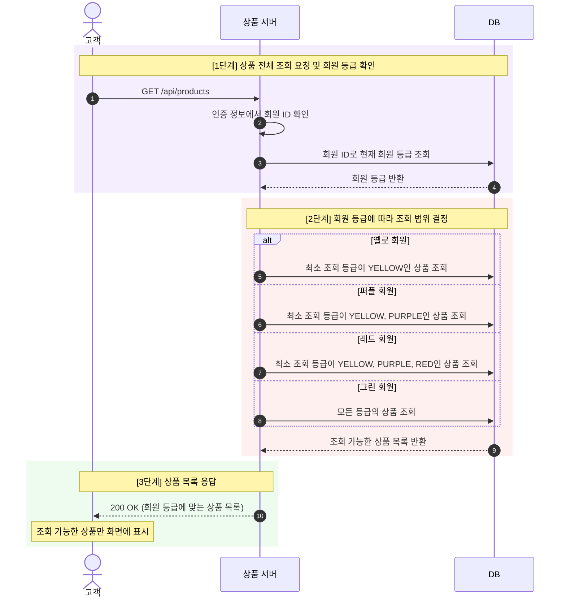
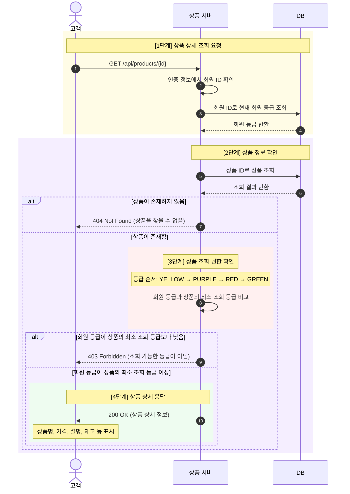
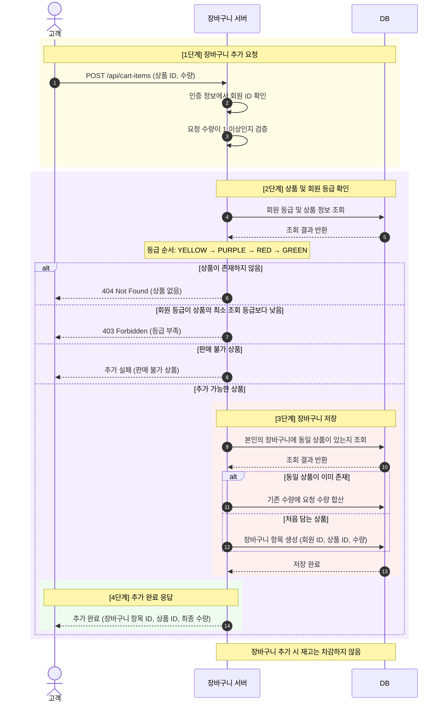
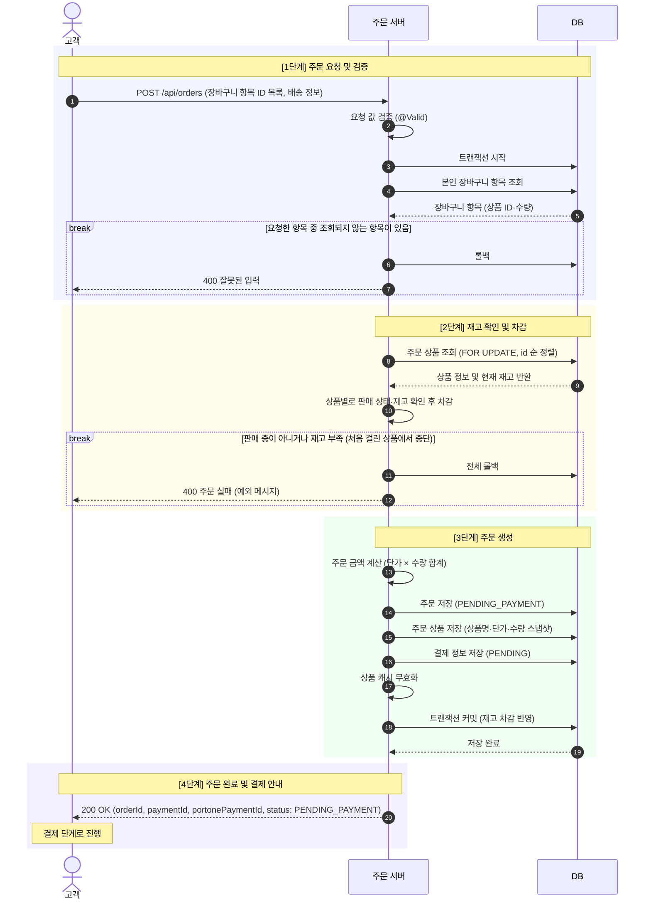
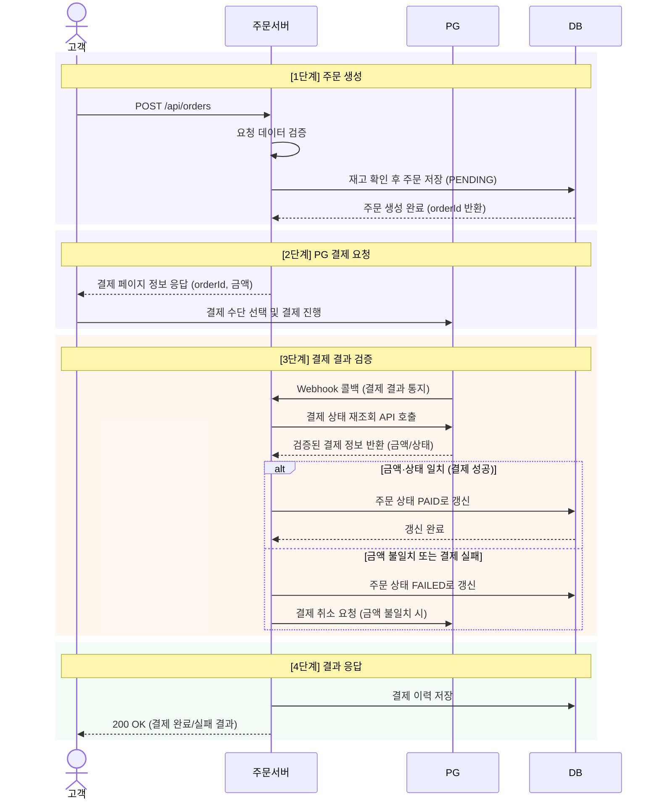
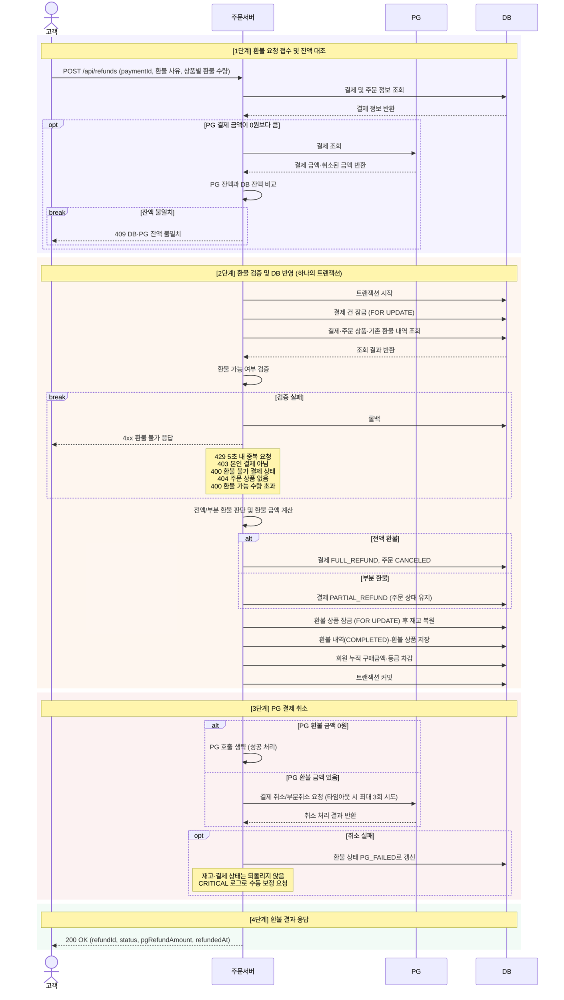
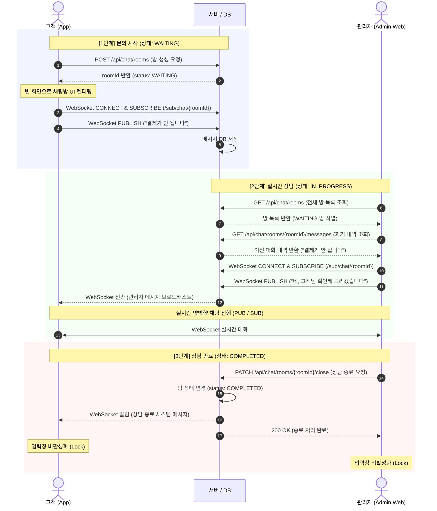
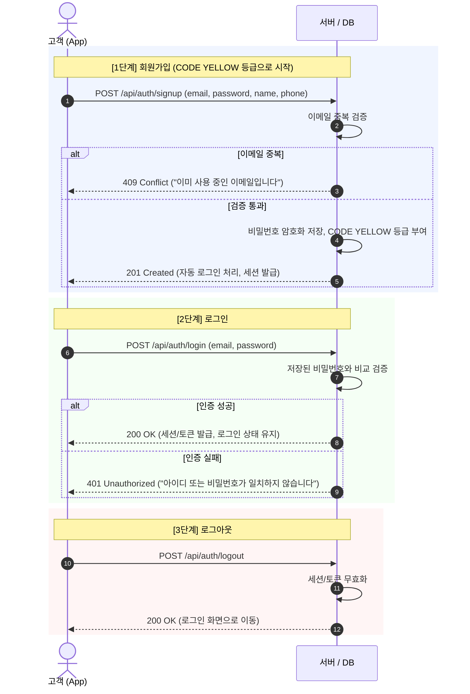
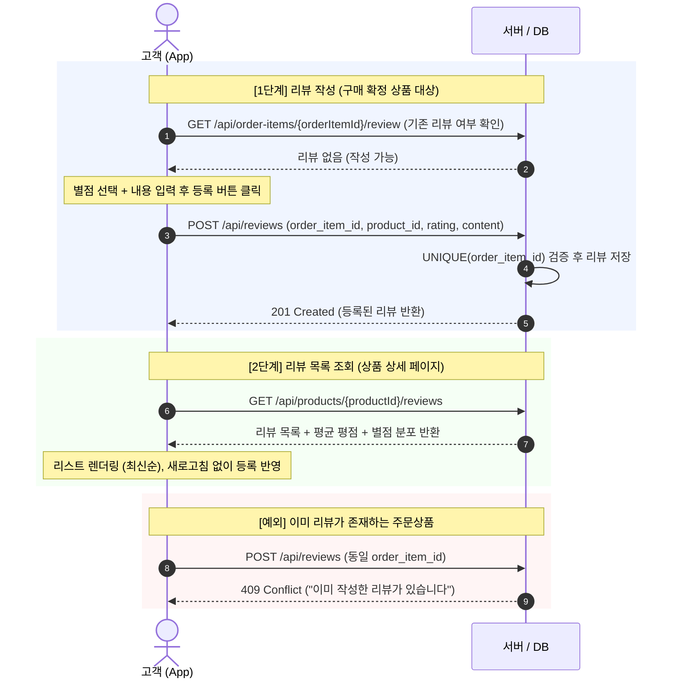
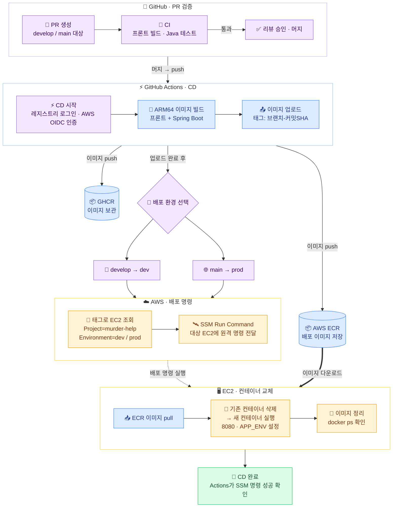

# 🔪 Murder-Help

> Spring Boot와 React로 만든 등급제 커머스 시스템

회원이 상품을 조회하고 장바구니에 담아 주문·결제·환불까지 진행할 수 있으며,
**회원 등급에 따라 접근 가능한 상품 등급이 달라지는** 커머스 플랫폼입니다.
Redis 캐시로 검색 성능을 확보하고, WebSocket 기반 실시간 문의 채팅을 함께 제공합니다.

프론트엔드 빌드 결과물이 Spring Boot의 정적 리소스로 포함되므로, 배포 산출물은 Docker 이미지 하나입니다.


## 🔗 Links

- [Wiki](https://github.com/team-4-ladder/Murder-Help/wiki)
- [API 명세서](./docs/api/API_SPEC.md)
- [상품 검색 성능 테스트 보고서](./docs/product-search-performance-test.md)
- [k6 부하 테스트 실행 가이드](./scripts/k6/README.md)

---

## 🚀 시작하기 (Getting Started)

### 요구 사항

| 항목 | 버전 |
|---|---|
| JDK | 17 |
| Gradle | Wrapper 포함 |
| Node | 22 이상 |
| pnpm | 10 |
| MySQL | 8.0 |
| Redis | 7 |

---

## 📌 주요 도메인 구조

### 패키지 구조

```
org.example.murderhelp
├── domain
│   ├── auth      # 회원가입 / 로그인 / 토큰 재발급 / 로그아웃
│   ├── member    # 내 정보 조회·수정, 프로필 이미지, 등급 정책
│   ├── product   # 상품 조회, 등급·카테고리 필터, 검색(v1/v2), 랭킹 배치
│   ├── search    # 인기 검색어 집계
│   ├── cart      # 장바구니 CRUD (담기/조회/수량변경/선택삭제)
│   ├── order     # 주문 생성, 기간별 주문 조회, 주문 상세
│   ├── payment   # PortOne 결제 승인/취소/실패 처리
│   ├── refund    # 부분·전액 환불, 환불 가능 수량 계산, 환불 이력
│   ├── review    # 리뷰 작성/수정/삭제, 상품별·내 리뷰 조회
│   └── chat      # STOMP 실시간 문의 채팅, 자동 응답 봇
├── infra
│   └── portone   # PortOne 클라이언트 / 설정 / 웹훅 수신·검증
└── global
    ├── config       # Security, Redis, Cache, WebSocket, QueryDSL, ShedLock
    ├── jwt          # JwtProvider
    ├── filter       # JwtAuthFilter
    ├── interceptor  # StompAuthInterceptor (WebSocket 연결 인증)
    ├── error        # ErrorCode, BusinessException, GlobalExceptionHandler
    ├── response     # 공통 응답 포맷(ApiResponse, PageResponse)
    ├── annotation   # 커스텀 검증 어노테이션(UniqueIdList 등)
    ├── util         # CookieUtil
    └── entity       # 공통 엔티티(BaseTimeEntity)
```

### 프론트엔드 구조

```
frontend/src
├── api          # 백엔드 호출 모듈 (auth, cart, member, orders, payment, ...)
├── components
│   ├── admin    # 상품 랭킹 관리
│   ├── auth     # 로그인 모달, 접근 제어 Gate
│   ├── cart     # 장바구니
│   ├── chat     # 플로팅 채팅 위젯, 관리자 채팅 대시보드
│   ├── common   # 공통 UI 조각
│   ├── member   # 마이페이지, 등급 배지/진행도
│   ├── order    # 결제, 주문 상세, 환불 모달
│   └── product  # 상품 카드/상세/리뷰, 사이드바
└── lib          # 테마, 등급 계산, 세션 스토리지
```

---

## 📌 주요 기능

### 등급 정책

회원 등급(`Grade`)과 상품 등급(`ProductTier`)이 같은 색 체계를 공유하며,
회원은 **자기 등급 이하의 상품만** 조회·구매할 수 있습니다.

| 등급 | 승급 기준 (누적 결제 금액) | 접근 가능 상품 |
|---|---|---|
|  | 기본 등급 |  |
|  | 100,000원 이상 |   |
|  | 500,000원 이상 |    |
|  | 운영자가 직접 부여 (관리자) | 전체 |

### 상품 검색 (v1 / v2)

동일한 검색 기능을 두 벌로 제공하며, Redis 캐시 적용 효과를 비교할 수 있습니다.

| API | 방식 |
|---|---|
| `GET /api/v1/products/search` | 매 요청마다 MySQL에서 직접 검색 |
| `GET /api/v2/products/search` | Redis Cache-aside, 캐시 미스일 때만 MySQL 조회 |

로컬 측정 기준 v2가 평균 응답 시간 약 90% 감소, 처리량 약 1.5배를 기록했습니다.
자세한 내용은 [성능 테스트 보고서](./docs/product-search-performance-test.md)에 정리되어 있습니다.

### 상품 랭킹 배치

매일 새벽 3시에 상품 랭킹을 갱신합니다. 다중 인스턴스 환경에서 중복 실행되지 않도록 **ShedLock(Redis)** 으로 잠금을 겁니다.
관리자는 `POST /api/admin/product-rankings/refresh`로 수동 갱신도 할 수 있습니다.

### 결제 · 환불

- PortOne 결제 승인 시 서버에서 **PG 결제 상태와 결제 금액을 재검증**한 뒤 주문을 확정합니다.
- PortOne 웹훅을 수신해 서명을 검증하고, 처리 상태를 `WebhookEvent`로 기록합니다.
- 주문 항목 단위 **부분 환불**을 지원하며, 이미 환불된 수량을 제외한 환불 가능 수량을 계산합니다.

### 실시간 문의 채팅

- STOMP over WebSocket(SockJS 폴백)으로 1:1 문의 채팅을 제공합니다.
- 연결 시 `StompAuthInterceptor`가 JWT를 검증합니다.
- **Redis Pub/Sub**으로 여러 애플리케이션 인스턴스 간 메시지를 전파합니다.
- 상담원 연결 전까지는 `BotScenario` 기반 자동 응답 봇이 대응합니다.

---

## Team Code Convention

### 📌 계층 구조

```
|- global
   |- config
   |- filter
   |- error
   |- response
|- infra
   |- ...
|- domain
   |- ...
      |- controller
      |- facade      # 여러 도메인을 묶는 트랜잭션이 필요한 경우에만
      |- service
      |- repository
      |- entity
      |- dto
```

`controller → (facade) → service → repository` 순으로 호출합니다.
여러 도메인에 걸친 트랜잭션은 `facade`에 둡니다 (`OrderFacade`, `PaymentFacade`, `RefundFacade`, `ChatFacade`).

모든 응답은 `ApiResponse`로 감싸고, 페이지 응답은 `PageResponse`를 사용합니다.
예외는 `BusinessException`과 `ErrorCode`로 정의하고 `GlobalExceptionHandler`에서 변환합니다.

### 코드

#### Enum

- Grade (회원 등급)

| Status | Description |
|---|---|
| `YELLOW` | 기본 등급 |
| `PURPLE` | 누적 결제 100,000원 이상 |
| `RED` | 누적 결제 500,000원 이상 |
| `GREEN` | 관리자 등급 (전체 상품 접근) |

- ProductTier (상품 등급)

| Status | Description |
|---|---|
| `YELLOW` | 모든 회원이 구매 가능 |
| `PURPLE` | PURPLE 이상 구매 가능 |
| `RED` | RED 이상 구매 가능 |
| `GREEN` | GREEN(관리자)만 구매 가능 |

- Product

| Status | Description |
|---|---|
| `ON_SALE` | 판매 중 |
| `SOLD_OUT` | 품절 |
| `DISCONTINUED` | 판매 중지 |

- Order

| Status | Description |
|---|---|
| `PENDING_PAYMENT` | 주문 생성 후 결제 대기 |
| `PAID` | 결제 완료 |
| `PREPARING_DELIVERY` | 배송 준비 중 |
| `SHIPPING` | 배송 중 |
| `DELIVERED` | 배송 완료 |
| `CANCELED` | 주문 취소 또는 전액 환불 완료 |

> 상태 전이 규칙은 `OrderStatus.canTransitTo()`에 정의되어 있습니다.

- Payment

| Status | Description |
|---|---|
| `PENDING` | 결제 대기 |
| `COMPLETED` | 결제 완료 (PG 승인 + 서버 검증 통과) |
| `FAILED` | 결제 실패 (PG 거절, 서버 검증 실패 등) |
| `CANCELLED` | 결제 완료 전 사용자가 직접 취소 (PG 미승인) |
| `PARTIAL_REFUND` | 일부 금액 환불 |
| `FULL_REFUND` | 전액 환불 완료 |

- Payment Fail Reason

| Type | Description |
|---|---|
| `PG_DECLINED` | PG사에서 결제를 거절 |
| `AMOUNT_MISMATCH` | 결제 금액 검증 실패 |
| `USER_CANCELLED` | 사용자가 결제를 취소 |

- Refund

| Status | Description |
|---|---|
| `COMPLETED` | 환불 완료 |
| `PG_FAILED` | PG 환불 요청 실패 |

- Webhook Event

| Status | Description |
|---|---|
| `RECEIVED` | 수신 완료, 처리 전 |
| `PROCESSED` | 정상 처리 완료 |
| `IGNORED` | 처리 대상이 아닌 이벤트 (예: `Transaction.Ready`) |
| `FAILED` | 처리 중 에러 발생, 재처리 대상 |

- Chat Room

| Status | Description |
|---|---|
| `BOT_MODE` | 자동 응답 봇 대응 중 (고객만 발화 가능) |
| `WAITING` | 상담원 배정 대기 |
| `IN_PROGRESS` | 상담 진행 중 |
| `COMPLETED` | 상담 종료 (발화 불가) |

- Chat Message

| Type | Description |
|---|---|
| `TEXT` | 일반 텍스트 메시지 |
| `SYSTEM` | 시스템 안내 메시지 |
| `BUTTON` | 봇 선택지 버튼 메시지 |

- Product Sort

| Type | Description |
|---|---|
| `POPULAR` | 인기순 (기본값) |
| `PRICE_ASC` | 낮은 가격순 |
| `PRICE_DESC` | 높은 가격순 |
| `NEWEST` | 최신 등록순 |

---

## 📌 Flowchart

### 1. 상품

회원 등급을 확인해 **조회 가능한 등급의 상품만** 목록으로 내려줍니다.

<details>
<summary><b>상품 목록 조회 흐름</b></summary>



</details>

---

### 2. 상품 상세

상품 존재 여부를 먼저 확인하고, 회원 등급이 상품의 최소 조회 등급 이상일 때만 상세 정보를 반환합니다.

<details>
<summary><b>상품 상세 조회 흐름</b></summary>



</details>

---

### 3. 장바구니

등급·판매 상태를 확인한 뒤 장바구니에 담습니다. 이미 담은 상품이면 수량을 합산하며, 이 단계에서 재고는 차감하지 않습니다.

<details>
<summary><b>장바구니 담기 흐름</b></summary>



</details>

---

### 4. 주문

재고를 잠그고(`FOR UPDATE`) 확인한 뒤 차감하고, 결제 대기 상태의 주문과 주문 상품 스냅샷을 저장합니다.

<details>
<summary><b>주문 생성 흐름</b></summary>



</details>

---

### 5. 결제

PG 결제 결과를 서버가 **재조회해 금액과 상태를 검증**한 뒤 주문 상태를 확정합니다.

<details>
<summary><b>결제 흐름</b></summary>



</details>

---

### 6. 환불

환불 가능 상태인지 검증하고 PG 취소를 요청한 뒤, 성공하면 재고를 복원하고 주문 상태를 갱신합니다.

<details>
<summary><b>환불 흐름</b></summary>



</details>

---

### 7. 채팅

문의 시작부터 상담원 응대, 상담 종료까지의 WebSocket 흐름입니다.

<details>
<summary><b>실시간 문의 채팅 흐름</b></summary>



</details>

---

### 8. 로그인/회원가입

회원가입은 이메일 중복을 검증한 뒤 기본 등급으로 계정을 만들고, 로그인·로그아웃은 토큰을 발급·무효화합니다.

<details>
<summary><b>로그인 · 회원가입 흐름</b></summary>



</details>

---

### 9. 리뷰

구매가 확정된 주문 상품에만 리뷰를 작성할 수 있고, 주문 상품 하나당 리뷰는 한 건입니다.

<details>
<summary><b>리뷰 작성 · 조회 흐름</b></summary>



</details>

---

## 🛠️ CI / CD

### CI (`.github/workflows/ci.yml`)

`develop`, `main` 대상 PR과 push에서 실행됩니다.

- **frontend** — pnpm 의존성 설치 후 프론트엔드 빌드. 프론트 빌드 실패를 CD의 Docker 빌드가 아니라 PR 단계에서 잡습니다.
- **build** — 백엔드 컴파일, 테스트, JaCoCo 리포트 생성. 커버리지 요약을 PR 코멘트로 남깁니다.

### CD (`.github/workflows/cd.yml`)

`develop`, `main`에 머지되면 실행됩니다. 두 브랜치 모두 직접 push가 막혀 있어 트리거는 사실상 "PR 머지"를 뜻합니다.

1. arm64 러너에서 Docker 이미지 빌드 (배포 대상 EC2가 t4g arm64)
2. GHCR과 ECR에 이미지 push
3. `Project` · `Environment` 태그로 EC2 인스턴스를 조회
4. SSM으로 배포 명령 실행

| 브랜치 | 배포 환경 | `APP_ENV` |
|---|---|---|
| `main` | prod | `prod` |
| `develop` | dev | `dev` |

운영 설정값(DB · Redis · JWT · PortOne)은 AWS Parameter Store(`/murder-help/{APP_ENV}/`)에서 주입합니다.
문서(`**.md`), `docs/`, `.github/` 변경만 있는 경우 CD는 건너뜁니다.



---

# 🧑‍💻 Contributors

<a href="https://github.com/prjkmo112"></a>&nbsp;&nbsp;&nbsp;&nbsp;
<a href="https://github.com/OdinAhn"></a>&nbsp;&nbsp;&nbsp;&nbsp;
<a href="https://github.com/wjdals0508"></a>&nbsp;&nbsp;&nbsp;&nbsp;
<a href="https://github.com/yulimlvphs"></a>&nbsp;&nbsp;&nbsp;&nbsp;
<a href="https://github.com/Yong-B"></a>&nbsp;&nbsp;&nbsp;&nbsp;
<a href="https://github.com/zcookiez"></a>&nbsp;&nbsp;&nbsp;&nbsp;
