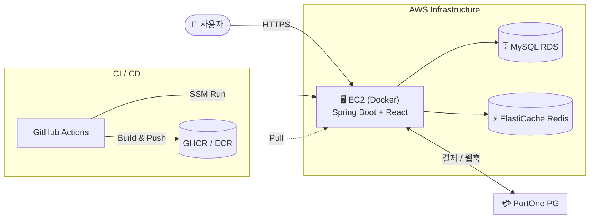
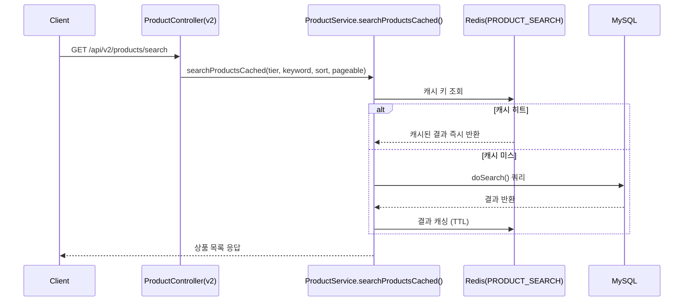
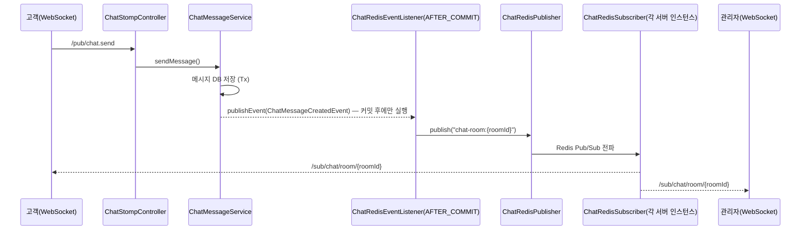

# 🔪 Murder-Help

> 회원 등급에 따라 접근 가능한 상품 등급이 달라지는 등급제 커머스 플랫폼입니다.<br>
> Redis 캐시로 검색 성능을 확보하고, STOMP 기반 실시간 문의 채팅 + 규칙 기반 챗봇을 제공합니다.

| 설명                 | 링크                                                           |
|--------------------|--------------------------------------------------------------|
| 팀 위키               | [Wiki](https://github.com/team-4-ladder/Murder-Help/wiki)    |
| API 명세서            | [API 명세서](https://app.notion.com/p/teamsparta/9682dc3ef5148327bc1001afca19bfbb?v=5af2dc3ef514827b9a3f887c371fe426)          |
| 캐시 적용 전/후 v1·v2 비교 | [상품 검색 성능 테스트 보고서](./docs/product-search-performance-test.md) |

---

### 🛠️ 기술 스택

| 구분 | 스택 |
|---|---|
| **Backend** | Java 17 · Spring Boot 4.1 · Spring Security · Spring Data JPA + QueryDSL · Spring WebSocket(STOMP) |
| **Frontend** | React 19 · TypeScript · Vite · Tailwind CSS 4 · `@stomp/stompjs` + `sockjs-client`· `@portone/browser-sdk` |
| **Database & Cache** | MySQL 8.0 · Redis 7 (Cache-aside, Pub/Sub, ShedLock 분산 락) · Caffeine(로컬/테스트 대체) |
| **Infra & CI** | Docker 멀티스테이지 빌드 · GitHub Actions(CI/CD) · AWS(EC2 arm64, ECR, RDS, ElastiCache, S3, Parameter Store, SSM) · GHCR |

---

### 📦 패키지 구조

**Backend**
```
org.example.murderhelp
├── domain
│   ├── auth      # 회원가입 / 로그인 / 토큰 재발급 / 로그아웃
│   ├── member    # 내 정보 조회·수정, 프로필 이미지, 등급 정책
│   ├── product   # 상품 조회, 등급·카테고리 필터, 검색(v1/v2)
│   ├── search    # 인기 검색어 집계
│   ├── cart      # 장바구니 CRUD (담기/조회/수량변경/선택삭제)
│   ├── order     # 주문 생성, 기간별 주문 조회, 주문 상세
│   ├── payment   # PortOne 결제 승인/취소/실패 처리
│   ├── refund    # 부분·전액 환불, 환불 가능 수량 계산, 환불 이력
│   ├── review    # 리뷰 작성/수정/삭제, 상품별·내 리뷰 조회
│   └── chat      # STOMP 실시간 문의 채팅, 챗봇, 챗봇 랭킹 캐시 파사드
│       ├── bot         # BotCommand, BotCommandDispatcher, BotScenario
│       ├── facade       # ChatFacade, ChatbotRankingFacade
│       ├── redis         # ChatRedisPublisher/Subscriber, ChatLastMessageCache, ChatbotRankingCache
│       ├── event          # ChatRedisEventListener, 캐시/랭킹 워밍업 리스너
│       └── scheduler       # ChatbotRankingScheduler (ShedLock)
├── infra
│   └── portone   # PortOne 클라이언트 / 설정 / 웹훅 수신·검증
└── global
    ├── config       # Security, Redis, Cache, WebSocket, QueryDSL, ShedLock
    ├── jwt          # JwtProvider
    ├── filter       # JwtAuthFilter
    ├── interceptor  # StompAuthInterceptor (WebSocket 연결 인증)
    ├── error        # ErrorCode, BusinessException, GlobalExceptionHandler
    ├── response     # 공통 응답 포맷(ApiResponse, PageResponse)
    ├── annotation   # 커스텀 검증 어노테이션(UniqueIdList 등)
    ├── util         # CookieUtil
    └── entity       # 공통 엔티티(BaseTimeEntity)
```


**Frontend**
```
frontend/src
├── api          # 백엔드 호출 모듈 (auth, cart, member, orders, payment, ...)
├── components
│   ├── admin    # 상품 랭킹 관리
│   ├── auth     # 로그인 모달, 접근 제어 Gate
│   ├── cart     # 장바구니
│   ├── chat     # 플로팅 채팅 위젯, 관리자 채팅 대시보드
│   ├── common   # 공통 UI 조각
│   ├── member   # 마이페이지, 등급 배지/진행도
│   ├── order    # 결제, 주문 상세, 환불 모달
│   └── product  # 상품 카드/상세/리뷰, 사이드바
└── lib          # 테마, 등급 계산, 세션 스토리지
```


---

## ☁️ 인프라 구성도


- 프론트엔드 빌드 결과물을 Spring Boot 정적 리소스로 포함해, 배포 산출물은 **Docker 이미지 하나**로 통일
- 배포 대상 EC2가 `t4g`(arm64)라 이미지도 arm64 러너에서 네이티브 빌드
- 운영 설정(DB·Redis·JWT·PortOne)은 AWS Parameter Store(`/murder-help/{APP_ENV}/`)에서 주입
- `main`→prod, `develop`→dev, 문서/워크플로만 바뀐 커밋은 CD 스킵

---

## 🔄 핵심 데이터 흐름

### 캐싱 — 상품 검색 Cache-aside (v2)



### 채팅 — STOMP + Redis Pub/Sub 멀티 인스턴스 브로드캐스트



---

## ✨ 핵심 기능

- **등급제 접근 제어** : `Grade`(회원)·`ProductTier`(상품)가 같은 색 체계를 공유, `canAccess()`로 자기 등급 이하 상품만 조회/구매 가능
- **Redis 캐시 3종** : 상품 검색 Cache-aside(v1/v2 비교), 챗봇 주간 베스트 랭킹, 채팅 마지막 메시지 캐시
- **실시간 상담+규칙기반 챗봇** : Redis Pub/Sub 멀티 인스턴스 브로드캐스트, `BotCommandDispatcher`가 무기 추천/주문 조회/상담사 연결 라우팅
- **결제·환불 신뢰성** : PortOne 결제를 서버에서 금액·상태 재검증, Webhook 서명 검증, 주문 항목 단위 부분 환불

---

## 📝 기술적 의사결정 및 트러블슈팅

> 담당자별 트러블슈팅/기술 의사결정 기록.

<details>
<summary><b>정민</b> — 결제 확정 로직에서 동시성 문제를 인식하고 해결하기</summary>

- [결제 확정 로직에서 동시성 문제를 인식하고 해결하기](https://record47584.tistory.com/125)
    
</details>

<details>
<summary><b>용범</b> — BBUMM 결제·환불 동시 처리에 따른 회원 등급 데이터 정합성 문제 해결</summary>

- [결제·환불 동시 처리에 따른 회원 등급 데이터 정합성 문제 해결](https://atom700.tistory.com/entry/%EA%B2%B0%EC%A0%9C%C2%B7%ED%99%98%EB%B6%88-%EB%8F%99%EC%8B%9C-%EC%B2%98%EB%A6%AC%EC%97%90-%EB%94%B0%EB%A5%B8-%ED%9A%8C%EC%9B%90-%EB%93%B1%EA%B8%89-%EB%8D%B0%EC%9D%B4%ED%84%B0-%EC%A0%95%ED%95%A9%EC%84%B1-%EB%AC%B8%EC%A0%9C-%ED%95%B4%EA%B2%B0)

</details>

<details>
<summary><b>준모</b> — CI/CD 파이프라인 트러블슈팅 (ARM64 빌드, 타임존)</summary>

- **문제**: 배포 대상 EC2가 `t4g`(arm64)인데 이미지는 `ubuntu-latest`(x86) 러너에서 빌드되고 있었음
- **해결**: `runs-on: ubuntu-24.04-arm`으로 바꿔 arm 러너에서 바로 빌드하고 QEMU 단계 제거. Dockerfile 빌더 단계에 `--platform=$BUILDPLATFORM`, 빌드에는 GHA 캐시 적용 (`cd.yml`, #11)
  <br><br>
- **문제**: 타임존이 맞지 않음
- **해결**: RDS 인스턴스 파라미터 그룹을 생성해 타임존 설정을 바꾸고, Docker에도 타임존 환경변수 추가

</details>

<details>
<summary><b>상윤</b> — 캐시 기능 구현 트러블슈팅 작성</summary>

- [캐시 기능 구현 트러블슈팅 작성](https://velog.io/@soulsin2/%EC%BA%90%EC%8B%9C-%EA%B8%B0%EB%8A%A5-%EA%B5%AC%ED%98%84-%ED%8A%B8%EB%9F%AC%EB%B8%94%EC%8A%88%ED%8C%85-%EC%9E%91%EC%84%B1)

</details>

<details>
<summary><b>현정</b> — 챗봇 명령어 처리 아키텍처 개선 및 설계 결정 · GitHub Actions CI 빌드 실패 트러블슈팅</summary>

- [챗봇 명령어 처리 아키텍처 개선 및 설계 결정](https://www.notion.so/3de9b79e9af880efbbc7f446eae887f6?v=08deae237f6b44ec9ebf7d9c0ab283ac&source=copy_link)
- [GitHub Actions CI 빌드 실패 트러블슈팅](https://www.notion.so/GitHub-Actions-CI-3de9b79e9af880ea87f4de51c6376866?v=08deae237f6b44ec9ebf7d9c0ab283ac&source=copy_link)

</details>

---

## 🧑‍💻 Contributors

<a href="https://github.com/prjkmo112"></a>&nbsp;
<a href="https://github.com/OdinAhn"></a>&nbsp;
<a href="https://github.com/wjdals0508"></a>&nbsp;
<a href="https://github.com/yulimlvphs"></a>&nbsp;
<a href="https://github.com/Yong-B"></a>&nbsp;
<a href="https://github.com/zcookiez"></a>
